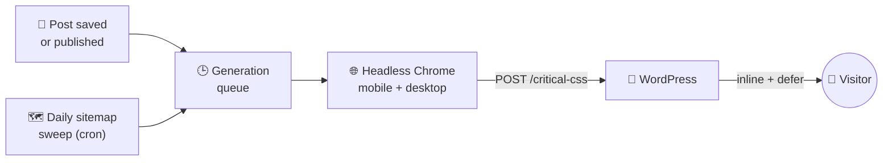

  
  

  
  &nbsp;
  
  &nbsp;
  
  &nbsp;
  
  &nbsp;
  

  
  &nbsp;
  
  &nbsp;
  
  &nbsp;
  
  &nbsp;
  

  <strong>Self-hosted critical CSS, generated by a real browser - not a WP Rocket subscription.</strong> 
  No metered quota. No SaaS. Your own container, your own control.

<strong>Table of contents</strong>

- [What it does](#what-it-does)
- [How it works](#how-it-works)
- [Features](#features)
- [Stack](#stack)
- [Documentation](#documentation)
- [Quick start](#quick-start)
- [Repo layout](#repo-layout)
- [Security & data](#security--data)
- [License](#license)

---

## What it does

WP Rocket's Remove Unused CSS and QUIC.cloud's free tier both solve the same problem - shipping only the CSS a page actually needs above the fold - behind a paid plan or a metered quota. **WP Critical CSS** does the same job with a container you run yourself: a companion Node service drives a real headless Chrome to render each URL and extract the above-the-fold CSS for mobile and desktop separately, and a small WordPress plugin inlines it and defers the rest.

No account, no per-page limits, no third-party service touching your site's HTML.

## How it works

Two independent triggers feed the same queue - editing a post regenerates just that page immediately, and the daily sweep catches everything else via the sitemap. Full request sequence and design decisions: [docs/ARCHITECTURE.md](docs/ARCHITECTURE.md).

## Features

| | Feature | What it does |
|---|---------|---------------|
| 🖼️ | **Real browser extraction** | Headless Chrome renders each URL and extracts above-the-fold CSS separately for mobile and desktop viewports - not a static CSS analyzer. |
| ⚡ | **Regenerate on save** | A `save_post` hook queues regeneration the moment a post or page is published or updated. |
| 🗺️ | **Sitemap sweep** | A daily cron job inside the container walks the sitemap, so pages nobody edited that day still stay covered. |
| 💉 | **Inline + defer** | Critical CSS is inlined in `<style id="wpcc-critical-css">`; the theme's regular stylesheets defer via the standard `media="print"` swap. |
| 🏠 | **Homepage handled separately** | The homepage isn't a single post, so its critical CSS is stored as site options instead of postmeta. |
| 🔒 | **SSRF-hardened by default** | Every fetch this service makes - page renders, the sitemap, sub-sitemaps, redirects - is blocked from reaching private/reserved addresses. |
| 🔑 | **One shared secret** | `WPCC_SHARED_SECRET` gates both the service's HTTP endpoints and the plugin's REST receiver, compared in constant time. |
| 🚦 | **Bounded queue, no silent drops** | The in-memory queue is capped (`MAX_QUEUE_LENGTH`); once full, `POST /generate` returns `503` with `Retry-After` instead of pretending the request was accepted. |
| 🐳 | **Container-first** | Ships as a Trivy-scanned, SBOM'd image to GHCR and Docker Hub. No PHP dependencies on the WordPress side at all. |

## Stack

| | Layer | Technologies |
|---|-------|---------------|
| 🟢 | **Service runtime** | Node.js 24 (ESM), Express 5, node-cron 4 |
| 🌐 | **Rendering** | Puppeteer + [`critical`](https://www.npmjs.com/package/critical) (via its `penthouse-esm` dependency) |
| 🐘 | **WordPress plugin** | PHP 7.4+, WordPress 6.0+ - REST receiver, `save_post` hook, WP-Cron trigger |
| 🐳 | **Container** | `ghcr.io/puppeteer/puppeteer` base, pinned by digest - published to GHCR and mirrored to Docker Hub |
| 🛡️ | **CI/CD security** | CodeQL, Semgrep, Trivy (CRITICAL gate + weekly re-scan of the published image), SonarCloud, gitleaks, SBOM + signed build provenance |

## Documentation

| Doc | Covers |
|-----|--------|
| 🏗️ [docs/ARCHITECTURE.md](docs/ARCHITECTURE.md) | System flow, request sequence, data flow, design decisions |
| 🚀 [docs/DEPLOYMENT.md](docs/DEPLOYMENT.md) | Full setup, verification, releases, rollback |
| 🛡️ [docs/SECURITY-CONTROLS.md](docs/SECURITY-CONTROLS.md) | Threat model, CI/CD security controls, conscious exclusions |
| 🐛 [SECURITY.md](SECURITY.md) | Vulnerability reporting |
| 📋 [CHANGELOG.md](CHANGELOG.md) | What changed in each release |
| 🤖 [AGENTS.md](AGENTS.md) · [CLAUDE.md](CLAUDE.md) | Conventions for AI coding agents working in this repo |

## Quick start

See [docs/DEPLOYMENT.md](docs/DEPLOYMENT.md) for the full walkthrough. In short:

1. Configure `.env` (copy from `.env.example`) and set the matching `WPCC_SHARED_SECRET` in `wp-config.php`.
2. Run the container - published image (GHCR or Docker Hub), build-from-repo, or local build. See `docker-compose.example.yml`.
3. Install the **WP Critical CSS** plugin: download `wp-critical-css-vX.Y.Z.zip` from a [release](https://github.com/solarssk/wp-critical-css/releases), then in wp-admin go to `Plugins` → `Add New Plugin` → `Upload Plugin` and activate. No server file access needed.

## Repo layout

| Path | Role |
|------|------|
| [`service/`](service/) | The generator - `server.js`, `lib.js`, `package.json`, `Dockerfile` |
| [`wordpress-plugin/wp-critical-css/`](wordpress-plugin/wp-critical-css/) | The installable plugin - `wp-critical-css.php` plus `includes/wpcc-trigger.php`, `wpcc-receiver.php`, `wpcc-inject.php`, `wpcc-shared.php` |
| [`wordpress-plugin/wp-critical-css-tests/`](wordpress-plugin/wp-critical-css-tests/) | PHPUnit + PHPCS tooling for the plugin (dev-only, not shipped) |
| [`.env.example`](.env.example) | Configuration template, including the shared secret format |
| [`docker-compose.example.yml`](docker-compose.example.yml) | The service block to add to an existing WordPress `docker-compose.yml` |
| [`.github/workflows/`](.github/workflows/) | CI, CodeQL/Semgrep SAST, the scan-then-publish container pipeline, the plugin-zip pipeline, and the release automation that ties them together |

## Security & data

`wpcc-receiver.php` is a public WordPress REST route gated by a shared secret, with an SSRF allowlist and XSS-safe CSS storage on top - see [docs/SECURITY-CONTROLS.md](docs/SECURITY-CONTROLS.md) for the full threat model, and [SECURITY.md](SECURITY.md) to report a vulnerability.

## License

[MIT](LICENSE)
