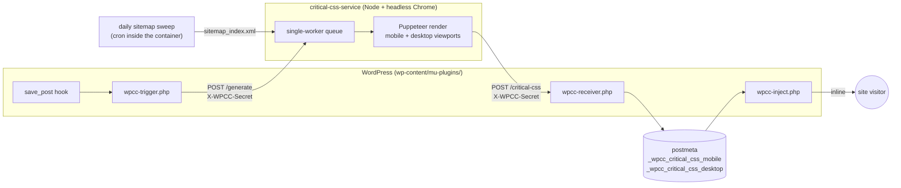
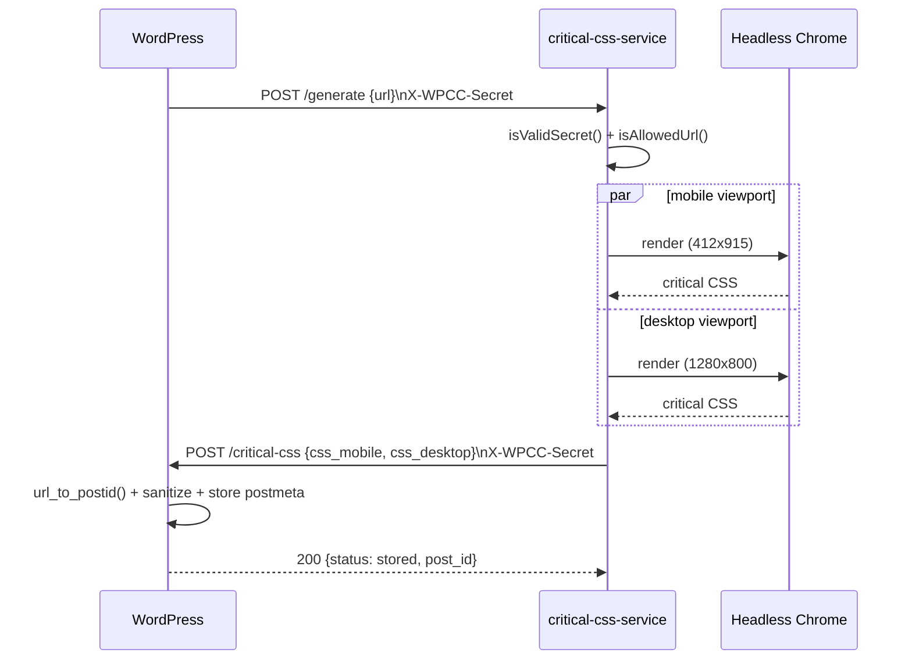

# Architecture

## System flow

Two independent paths feed the same queue:

- **Webhook (fast path).** `save_post` on a `post`/`page` schedules a WP-Cron
  event (a cheap options-table write, zero network I/O on the editor's own
  request) which then POSTs to `/generate` from a separate WP-Cron-spawned
  request.
- **Sitemap sweep (safety net).** A daily cron inside the generator
  container re-crawls `post-sitemap*.xml`/`page-sitemap.xml`, catching
  anything the webhook missed - restarts, manual DB edits, or the first run
  against existing content.

Both funnel into the same single-worker queue, so at most one Chrome
instance ever runs at a time regardless of how many requests land at once -
this is what keeps memory/CPU bounded on modest hardware.

## Request detail

`isValidSecret()` and `isAllowedUrl()` are the two gates that make this
endpoint safe to expose on an internal Docker network - see
[SECURITY-CONTROLS.md](SECURITY-CONTROLS.md) for the threat model behind
each.

## Data flow

| Data | Lives in | Notes |
|---|---|---|
| Shared secret | `.env` (generator) and `wp-config.php` constant `WPCC_SHARED_SECRET` (WordPress) | Never committed; both sides fail closed if missing |
| Rendered critical CSS | WordPress `postmeta`: `_wpcc_critical_css_mobile`, `_wpcc_critical_css_desktop`, `_wpcc_critical_css_generated_at` | Sanitized on write (receiver) and again independently on read (inject) |
| In-flight queue | In-memory array inside the generator process | Not persisted - a container restart mid-sweep just means the sweep (or the next `save_post`) re-enqueues the URL |

## Design decisions

- **Per-post, not per-template.** Page builders like Elementor emit a
  separate physical CSS file per post (`post-11.css`, `post-8837.css`,
  ...), so the critical subset has to be recomputed per post, not once per
  template.
- **Single-worker queue.** At most one Chrome instance runs at a time -
  safe for modest hardware, at the cost of the sitemap sweep taking a
  while on first run (tune `SWEEP_DELAY_MS`, default 5s between URLs).
- **Sitemap sweep is filtered to `post`/`page` sub-sitemaps only.**
  `url_to_postid()` can only resolve single posts/pages - taxonomy archive
  URLs (tags, categories, the homepage) always 404 at the receiver, so
  including them would waste a full Puppeteer render (up to 60s per
  viewport) on a request that's guaranteed to fail. See the filter in
  `fetchSitemapUrls()` (`service/server.js`) - adjust the pattern if your
  sitemap generator names sub-sitemaps differently.
- **Only `post` and `page` post types trigger the webhook** by default -
  matches the `in_array()` check in `wpcc-trigger.php`. Extend it if other
  post types need this too.
- **`WPCC_BREAKPOINT` (782px, in `wpcc-inject.php`)** matches WordPress
  core's own mobile/desktop admin-bar breakpoint by default - tune it if
  your theme's real breakpoint differs.
- **`cap_add: SYS_ADMIN` on the container** is required by the official
  Puppeteer image for Chrome's sandbox to work - documented by the
  Puppeteer team, not a workaround. `critical` doesn't expose a way to
  pass `--no-sandbox` instead, so this is the correct path.

## Rollback

Remove the three mu-plugin files from `wp-content/mu-plugins/` and stop
the container. Nothing else depends on this pipeline - stylesheets simply
go back to loading render-blocking, exactly as before it existed.
