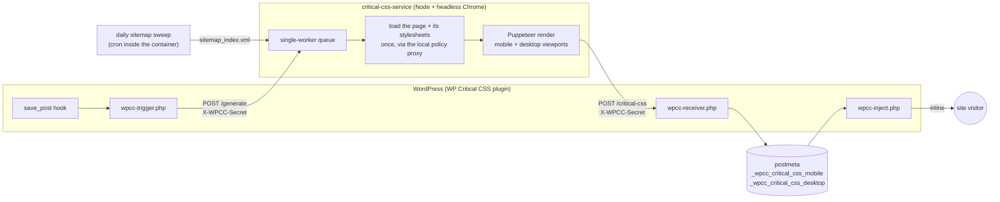
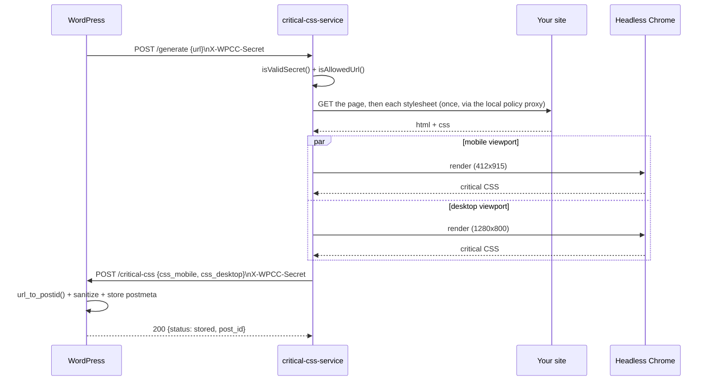

# Architecture

## System flow

```mermaid
flowchart LR
    subgraph wp["WordPress (WP Critical CSS plugin)"]
        SP["save_post hook"] --> TR["wpcc-trigger.php"]
        RC["wpcc-receiver.php"]
        IJ["wpcc-inject.php"]
    end

    subgraph gen["critical-css-service (Node + headless Chrome)"]
        QUEUE["single-worker queue"]
        LOAD["load the page + its stylesheets\nonce, via the local policy proxy"]
        RENDER["Puppeteer render\nmobile + desktop viewports"]
    end

    SWEEP["daily sitemap sweep\n(cron inside the container)"]

    TR -- "POST /generate\nX-WPCC-Secret" --> QUEUE
    SWEEP -- "sitemap_index.xml" --> QUEUE
    QUEUE --> LOAD --> RENDER
    RENDER -- "POST /critical-css\nX-WPCC-Secret" --> RC
    RC --> PM[("postmeta\n_wpcc_critical_css_mobile\n_wpcc_critical_css_desktop")]
    PM --> IJ
    IJ -- "inline <style>, defer stylesheets" --> Visitor(("site visitor"))
```

Two independent paths feed the same queue:

- **Webhook (fast path).** `save_post` on a `post`/`page` schedules a WP-Cron
  event (a cheap options-table write, zero network I/O on the editor's own
  request) which then POSTs to `/generate` from a separate WP-Cron-spawned
  request.
- **Sitemap sweep (safety net).** A daily cron inside the generator
  container re-crawls `post-sitemap*.xml`/`page-sitemap.xml`, catching
  anything the webhook missed - restarts, manual DB edits, or the first run
  against existing content.

Both funnel into the same single-worker queue, so at most one Chrome
instance ever runs at a time regardless of how many requests land at once -
this is what keeps memory/CPU bounded on modest hardware.

## Request detail

```mermaid
sequenceDiagram
    participant WP as WordPress
    participant Gen as critical-css-service
    participant Web as Your site
    participant Chrome as Headless Chrome

    WP->>Gen: POST /generate {url}\nX-WPCC-Secret
    Gen->>Gen: isValidSecret() + isAllowedUrl()
    Gen->>Web: GET the page, then each stylesheet (once, via the local policy proxy)
    Web-->>Gen: html + css
    par mobile viewport
        Gen->>Chrome: render (412x915)
        Chrome-->>Gen: critical CSS
    and desktop viewport
        Gen->>Chrome: render (1280x800)
        Chrome-->>Gen: critical CSS
    end
    Gen->>WP: POST /critical-css {css_mobile, css_desktop}\nX-WPCC-Secret
    WP->>WP: url_to_postid() + sanitize + store postmeta
    WP-->>Gen: 200 {status: stored, post_id}
```

`isValidSecret()` and `isAllowedUrl()` are the two gates that make this
endpoint safe to expose on an internal Docker network - see
[SECURITY-CONTROLS.md](SECURITY-CONTROLS.md) for the threat model behind
each.

## Loading the page

The service does not hand a URL to a library and wait: it loads the page and its stylesheets itself, once per job, and renders both viewports from that one copy. `generateCriticalCss()` (`service/critical-css.js`) is the single call that does it, for `server.js` and for the container smoke test (`service/scripts/check-render.mjs`) alike. Four modules, one job each:

| Module | Job |
|---|---|
| `service/page-fetch.js` | The only server-side HTTP for a page and its stylesheets. Policy per hop (scheme, credentials, private IP literals, the page's host pin), manual redirects, status and content-type checks, caps that count decoded bytes, deadlines, stable error codes. The client (`undici`) reaches the network only through the local policy proxy. |
| `service/stylesheets.js` | Which stylesheets a page has: `parse5` with a depth guard and a work bound, an iterative walk, `<base href>`, `data:` links, media wrapping. Pure: no I/O. |
| `service/rebase.js` | Rewrites the `url()`s of a stylesheet so it still works inline (`postcss-url`), after a size guard and a work guard. Pure. |
| `service/critical-css.js` | The failure policy, the budgets, the layout copy that penthouse renders, `renderViewport()` and `generateCriticalCss()`. |

In order:

1. Fetch the page. Anything but a 2xx answer, a content type that is not HTML or XHTML, or a redirect off `ALLOWED_HOSTNAME` fails the job.
2. Parse it and discover its stylesheets (`<link rel="stylesheet">`, `<link rel="preload" as="style">`, `<style>`, `data:` links) the way the `critical` package did, in document order.
3. Fetch the stylesheets one after the other. One that cannot be loaded fails the job when it is on the page's own host, because critical CSS that silently lacks the owner's own rules is worse than none, and is skipped with a warning when it is on another host (a CDN, a font service).
4. Rewrite each stylesheet's `url()`s, join the sheets, and write a copy of the page with the CSS injected to a private temporary directory (`mkdtemp`, removed in a `finally`, one per viewport).
5. Penthouse lays that copy out in the guarded Chrome for each viewport, the project's media-query pruning (`stripInapplicableMediaQueries()`) runs over its output, and `clean-css` minifies it.

What a stylesheet reference can be is a URL to fetch, never a file to read: nothing a page says reaches the local file system. The limits (sizes, stylesheet count, redirects, time, markup depth, rewrite work) and the error codes are constants in these modules and are listed for operators in [DEPLOYMENT.md](DEPLOYMENT.md#upgrading-from-028). `service/fixtures/parity/` records 254 cases of what the replaced `critical@8.0.0` did, the unit tests replay them, and 53 further cases (its README lists them) are the deliberate differences.

## Data flow

| Data | Lives in | Notes |
|---|---|---|
| Shared secret | `.env` (generator) and `wp-config.php` constant `WPCC_SHARED_SECRET` (WordPress) | Never committed; both sides fail closed if missing |
| Rendered critical CSS | WordPress `postmeta`: `_wpcc_critical_css_mobile`, `_wpcc_critical_css_desktop`, `_wpcc_critical_css_generated_at` | Sanitized on write (receiver) and again independently on read (inject) |
| In-flight queue | In-memory array inside the generator process | Not persisted - a container restart mid-sweep just means the sweep (or the next `save_post`) re-enqueues the URL |

## Design decisions

- **Per-post, not per-template.** Page builders like Elementor emit a
  separate physical CSS file per post (`post-11.css`, `post-8837.css`,
  ...), so the critical subset has to be recomputed per post, not once per
  template.
- **Single-worker queue.** At most one Chrome instance runs at a time -
  safe for modest hardware, at the cost of the sitemap sweep taking a
  while on first run (tune `SWEEP_DELAY_MS`, default 5s between URLs).
- **Sitemap sweep is filtered to `post`/`page` sub-sitemaps only.**
  `url_to_postid()` can only resolve single posts/pages - taxonomy archive
  URLs (tags, categories) always 404 at the receiver, so including them
  would waste a full Puppeteer render (up to 60s per viewport) on a request
  that's guaranteed to fail. (The homepage is the one URL the receiver
  does resolve itself, by comparing it with `home_url()`; it stores that CSS as
  site options.) See the filter in
  `fetchSitemapUrls()` (`service/server.js`) - adjust the pattern if your
  sitemap generator names sub-sitemaps differently.
- **Only `post` and `page` post types trigger the webhook** by default -
  matches the `in_array()` check in `wpcc-trigger.php`. Extend it if other
  post types need this too.
- **`WPCC_BREAKPOINT` (782px, in `wpcc-inject.php`)** matches WordPress
  core's own mobile/desktop admin-bar breakpoint by default - tune it if
  your theme's real breakpoint differs.
- **No `cap_add: SYS_ADMIN` on the container.** Chrome runs with
  `--no-sandbox`/`--disable-setuid-sandbox` (`PUPPETEER_LAUNCH_ARGS`,
  `service/server.js`), so the elevated capability the real Chrome sandbox
  would otherwise need is never used - confirmed empirically, and
  `docker-compose.example.yml`/`docs/SECURITY-CONTROLS.md` cross-reference
  this same tradeoff. `penthouse` does not take launch args directly, but
  its `puppeteer.getBrowser` option accepts a function that supplies an
  already-launched browser instance instead of letting penthouse start its
  own - `getSsrfSafeBrowser()` uses this to call `puppeteer.launch()`
  itself with `PUPPETEER_LAUNCH_ARGS` (and to wire up this project's own
  SSRF-guarded request interception on every page it hands out);
  `generateCriticalCss()` refuses to run the real penthouse without it, so a
  forgotten launcher can never mean an unguarded Chrome. Those
  launch args also point Chrome at a small proxy the service runs on
  `127.0.0.1` (`service/ssrf-proxy.js`), which is Chrome's only way onto the
  network: it resolves each name once, refuses private/reserved addresses and
  connects to the address it validated (see `docs/SECURITY-CONTROLS.md`).
- **No `critical` package: the service owns the page-loading layer.**
  `critical` fetched the page and its stylesheets with its own HTTP client,
  so the SSRF policy had to be bolted on through that client's hooks, it
  fetched everything once per viewport, and its dependency tree (a glob
  stack the service never called) kept the required audit check red on an
  advisory with no fix. The service now loads the page itself, through the
  same local policy proxy Chrome uses, and calls `penthouse-esm` directly.
  The behaviour it replaced is pinned by the parity fixtures
  (`service/fixtures/parity/`); where it differs on purpose the fixtures say
  so. Page loading is the one place that has to stay first-party: do not
  add another HTTP client or a library that fetches on its own for it.

## Rollback

Deactivate (or delete) the plugin from `Plugins` in wp-admin and remove the
container (`docker compose down`; a merely stopped one comes back after a reboot
with `restart: always`). Nothing else depends on this pipeline - stylesheets simply go
back to loading render-blocking, exactly as before it existed.
