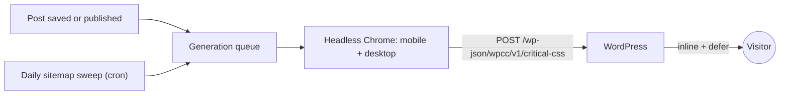

# WP Critical CSS

**Self-hosted critical CSS, generated by a real browser - not a WP Rocket subscription.** No metered quota, no SaaS: your own container, your own control.

WP Rocket's "Remove Unused CSS" and QUIC.cloud's free tier solve one problem - shipping only the CSS a page needs above the fold - behind a paid plan or a quota. WP Critical CSS does the same job with two parts you run yourself:

- a small **service** (a Node container with headless Chrome) that renders each page and extracts the above-the-fold CSS for mobile and desktop separately, and
- a **WordPress plugin** that stores that CSS, inlines it into the page and defers the page's regular stylesheets.

No account, no per-page limits, and no third-party service ever sees your site's HTML.

## How it fits together

Two independent triggers feed one queue: saving a post regenerates just that page shortly after (through WP-Cron), and a daily sweep of your sitemap catches everything else. The details are on [How It Works](How-It-Works).

## Where to start

| I want to... | Read |
|---|---|
| Set it up for the first time | [Getting Started](Getting-Started) |
| Look up a setting, a default or an endpoint | [Configuration](Configuration) |
| Install or verify the WordPress plugin | [Install the Plugin](Install-the-Plugin) |
| Understand what happens to a page | [How It Works](How-It-Works) |
| Know what is protected and what I must do | [Security Overview](Security-Overview) |
| Lock the container's network down further | [Network Egress Filtering](Network-Egress-Filtering) |
| Fix something that does not work | [Troubleshooting](Troubleshooting) |
| Update to a new release, or roll back | [Upgrading and Releases](Upgrading-and-Releases) |
| Change these pages | [Editing the Wiki](Editing-the-Wiki) |

## Good to know

- **Not on WordPress.org.** The plugin is installed from a [GitHub release](https://github.com/solarssk/wp-critical-css/releases) zip.
- **Only the latest release is supported.** Deploy from a tagged release, not from `main`.
- **Nothing breaks if it stops.** Pages without generated CSS load their stylesheets exactly as before the plugin existed; see [Upgrading and Releases](Upgrading-and-Releases#roll-back).
- **Deeper reading** lives in the repository: [architecture](https://github.com/solarssk/wp-critical-css/blob/main/docs/ARCHITECTURE.md), [security controls](https://github.com/solarssk/wp-critical-css/blob/main/docs/SECURITY-CONTROLS.md), the [changelog](https://github.com/solarssk/wp-critical-css/blob/main/CHANGELOG.md), and the [vulnerability reporting policy](https://github.com/solarssk/wp-critical-css/blob/main/SECURITY.md).
