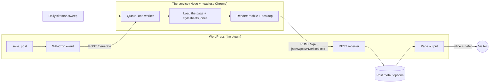

# How It Works

## The flow

## Two ways a page gets queued

- **When you save it (fast path).** Publishing or updating a `post` or a `page` schedules a WP-Cron event. A separate WP-Cron request then asks the service to render the page, so the editor's own save is never delayed by a network call (and the render is not instant). On a site that sets `DISABLE_WP_CRON` without a system cron, that event never runs. Autosaves, revisions, drafts and other post types are ignored.
- **The daily sweep (safety net).** At 03:00 by default the service reads your sitemap and queues every post and page in it. It catches anything the fast path missed: a restart, a manual database edit, content that existed before you installed the plugin.

Both feed the same queue. It is in memory, holds each URL once (a second request for a queued URL answers `already queued`), and has a ceiling (`MAX_QUEUE_LENGTH`). A restart empties it; the next sweep or save queues the page again. The plugin does not wait for the service's answer, so a save that arrives while the queue is full is dropped (the service logs it) until the next save or sweep.

## What the service does with a URL

1. It checks the secret and that the URL is on `ALLOWED_HOSTNAME`.
2. **One worker** takes the next URL, so at most one Chrome runs at a time. That keeps memory and CPU bounded on modest hardware, at the cost of a long first sweep.
3. **It loads the page and its stylesheets, once.** The service fetches the page itself (a plain `GET`), finds its stylesheets (`<link rel="stylesheet">`, preloaded stylesheets and `<style>` blocks) and fetches the linked ones one after the other. Both viewports are rendered from that single copy. What a problem with a page or a stylesheet means is under [How a page is loaded](#how-a-page-is-loaded).
4. It renders the page twice, as a **mobile** viewport (412 x 915) and a **desktop** viewport (1280 x 800), and extracts the CSS the visible part needs. Each render is limited to 60 seconds. Media queries that cannot apply to that range of screen widths are pruned, which keeps the desktop output small.
5. **Page JavaScript is switched off while rendering**, and everything the service and Chrome load goes through a policy proxy that refuses private and reserved addresses. See [Security Overview](Security-Overview).
6. It delivers both stylesheets to WordPress. A network error or a 5xx answer is retried; a rejection (a 4xx) is not, because a retry cannot fix it.

## How a page is loaded

The service fetches the page and its stylesheets before Chrome starts, and gives Chrome a copy of the page with that CSS in it to lay out. These rules decide what a problem means:

- **The page must load cleanly.** Any answer but a 2xx status, a type that is not `text/html` or `application/xhtml+xml`, or a redirect to a host name other than `ALLOWED_HOSTNAME` fails the job. A maintenance page or a bot-challenge page is never mistaken for your page.
- **A stylesheet on your own site must load.** One that cannot (a 404 or 5xx, a timeout, a body over the limit, an HTML page served in its place) fails the job, because critical CSS without your own rules would be wrong. "Your own site" means the same host name and port, whatever the scheme.
- **A stylesheet on another host is optional.** A CDN, a font service or a widget that cannot be loaded is left out, and the log gets one warning (`skipping a stylesheet that could not be loaded from another host`).
- **A failed job delivers nothing.** The CSS WordPress already has for that page stays, and the next save or sweep tries again. There are no retries inside a job.
- **Nothing is truncated silently.** Going over a limit below fails the job (or, for a stylesheet on another host, leaves that stylesheet out) with a message that says which limit.

| Limit | Value |
|---|---|
| The page (HTML) | 10 MiB |
| One stylesheet (linked, inline or a `data:` link) | 2 MiB |
| All stylesheets together | 8 MiB |
| Stylesheets per page (inline and `data:` ones count) | 100 |
| Redirects per request | 5 |
| One request | 30 seconds in all, 15 without receiving data |
| The page and all its stylesheets together | 60 seconds |

They are fixed, not settings, and chosen with room to spare: a real WordPress homepage built with Elementor, measured while choosing them, is 515 KiB of HTML and 23 stylesheets of 1.05 MiB in all. The service identifies itself as `Mozilla/5.0 (compatible; wp-critical-css/<version>; +https://github.com/solarssk/wp-critical-css)` on every request for a page or a stylesheet, so a firewall can allow it. The messages are explained on [Troubleshooting](Troubleshooting#a-job-fails-before-anything-is-delivered); markup depth, the rewriting work limit and the rest are in the [deployment guide](https://github.com/solarssk/wp-critical-css/blob/main/docs/DEPLOYMENT.md#upgrading-from-028).

## What WordPress does with the result

The receiver checks the secret, applies size and rate limits, strips anything that could break out of a `<style>` element, and stores the CSS:

| Page | Stored in |
|---|---|
| A published post or page | Post meta: `_wpcc_critical_css_mobile`, `_wpcc_critical_css_desktop`, `_wpcc_critical_css_generated_at` |
| The homepage | Site options: `wpcc_front_page_css_mobile`, `wpcc_front_page_css_desktop`, `wpcc_front_page_css_generated_at` |

The homepage is stored separately because it is not one post: even when it is a static page, WordPress routes it differently, so the service cannot resolve it to a post ID. The receiver recognises it by comparing the delivered URL with `home_url()`.

Only published posts and pages are accepted. Attachments, drafts and other post types are refused, and so are archive URLs (tags, categories, authors), which cannot be mapped to a post.

## What the visitor gets

On a page that has stored CSS, the plugin:

- puts `<style id="wpcc-critical-css">` very early in the `<head>`, with the mobile CSS inside `@media (max-width: 782px)` and the desktop CSS inside `@media (min-width: 783px)`. The browser picks the right one itself, so there is no user-agent sniffing and page caches keep working;
- defers the page's stylesheets (the theme's and plugins') with the standard `media="print" onload="this.media='all';this.onload=null;"` swap, and keeps a `<noscript>` copy of each original tag.

A stylesheet that is not render-blocking in the first place (its own `media` is something other than `all` or `screen`) is left untouched. On a page with **no** stored CSS - not generated yet, an archive, a paginated homepage, any other post type - nothing changes: stylesheets load exactly as before.

## Design decisions

- **Per post, not per template.** Page builders such as Elementor write a separate CSS file per post, so the critical subset has to be worked out per post.
- **A single worker.** Safe on small servers; the price is that a large site takes a while to backfill. Tune `SWEEP_DELAY_MS`.
- **The service loads pages itself.** It fetches the page and its stylesheets with its own code, behind the same local proxy as Chrome, instead of leaving that to a library with a client of its own. That is what lets every request be checked and bounded.
- **The sweep only follows post and page sitemaps.** Taxonomy and author sitemaps list URLs the receiver cannot resolve, so rendering them would waste a full render on a delivery that is guaranteed to fail. A sweep also stops at 50 sub-sitemaps and 5,000 URLs, so a hostile or enormous sitemap cannot flood the queue.
- **No elevated container capability.** Chrome runs with its own sandbox off and the container is hardened instead (the sandbox plus the capability it needs did not work cleanly with the read-only container); see [Security Overview](Security-Overview).

The full architecture notes are in the repository: [docs/ARCHITECTURE.md](https://github.com/solarssk/wp-critical-css/blob/main/docs/ARCHITECTURE.md).
